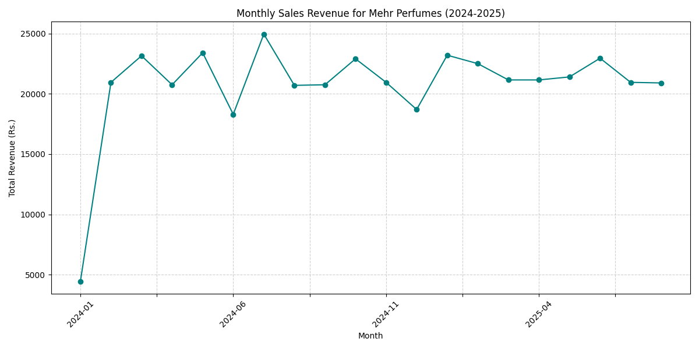
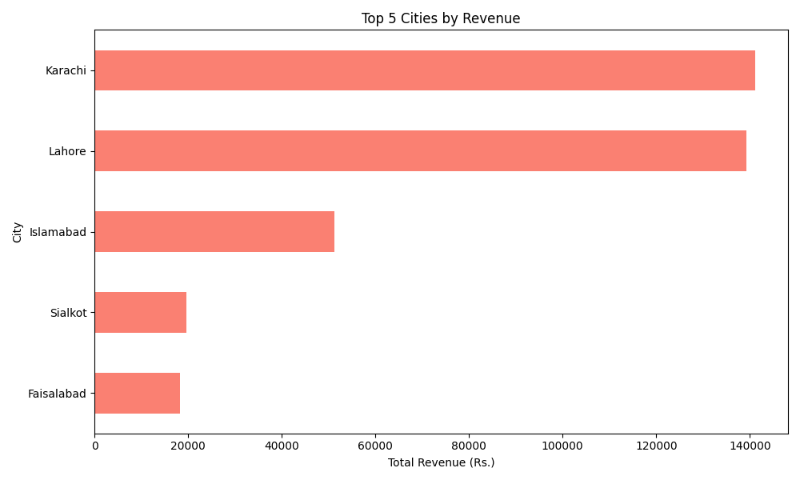

# Mehr Perfumes: E-Commerce Sales Analysis

## Project Overview
This project is a comprehensive analysis of sales data for Mehr Perfumes, a retail e-commerce business based in Pakistan. The goal is to identify key trends in sales, customer behavior, and product performance to provide actionable insights for business growth.

## Business Questions
1. What is our total revenue and AOV?
2. Who are our top customers and where are they located?
3. Which products and channels are performing best?
4. What are the monthly sales trends?
5. What is our customer retention rate?

## Tools Used
- **Data Cleaning & Initial Exploration:** MS Excel
- **Data Storage & Querying:** SQL (SQLite)
- **Data Analysis & Visualization:** Python (Pandas, Matplotlib)
- **Interactive Dashboarding:** Microsoft Power BI

## Analysis & Findings
### Key KPIs
- **Total Revenue:** Rs. 385,850
- **Average Order Value:** Rs. 2,144
- **Repeat Customer Rate:** 33.6%

### Visualizations
**(Embed the .png images you created with Python here)**

**Monthly Sales Trend**

**Top 5 Products by Revenue**

**Top 5 Cities by Revenue**

## Interactive Dashboard
A Power BI dashboard was created to provide an interactive way to explore the sales data. 
**(Add a screenshot of your Power BI dashboard here)**

## Conclusions & Recommendations
- **Focus Marketing on Top Cities:** Allocate more marketing budget to Karachi and Lahore.
- **Inventory Management:** Ensure top-selling products like 'Majesty' and 'Arwaah' are always in stock.
- **Channel Strategy:** Double down on Instagram marketing and optimize the Website sales funnel.
- **Customer Loyalty Program:** Launch a program to further increase the 33.6% repeat customer rate.
